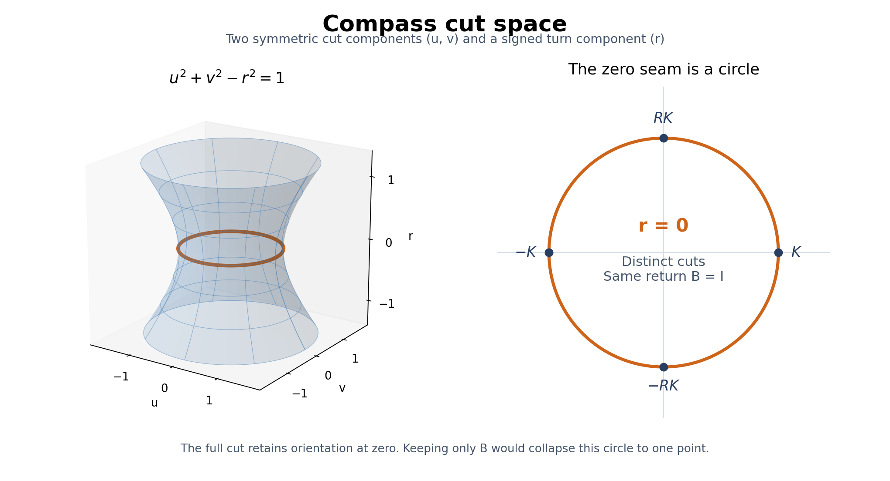

# LS1 — a connected compass space, its metric and its zero seam

10 October 2026 (India). Continues the primitive-space discussion after
YC23 at `d26c450`. The owner wants compass space itself to carry the
nonzero-level structure, with a zero-level equilibrium reading. This
stage constructs an explicit analytic target from the existing two-mode
native algebra. It does not identify that target with the entire primitive
lambda carrier, every tensor tower, physical spacetime, or a YM vacuum.

**Results.** The space of oriented nontrivial two-sided cuts is a connected
real-analytic cylinder. A fixed positive coefficient pairing gives a complete
distance and a complete positive Riemannian metric. Its zero-return set is
a circle, not a point. The existing native transport is globally defined
and analytic, with curvature 2r R dr wedge dphi. Pulling this universal
target back recovers UP8/YC13 without constructing a different target space
for each scalar potential. The response map, metric calibration, transport
protocol and tower interpolation retain their separate hypotheses.

Use **r** for a normalized signed depth in this chart. The user calls the
whole proposed primitive object lambda-space; r is not silently identified
with the earlier source amplitude lambda, probe eta, derivative order n,
observation lambda-zero, physical radius, time or RG scale.

## 1. Cut space from the admitted native carrier

Fix the existing real two-mode representation and reference pairing:

\[
 R=\begin{pmatrix}0&-1\\1&0\end{pmatrix},\quad
 K=\operatorname{diag}(1,-1),\quad J=RK.
\]

UP7 supplies all nontrivial real involutions. Write their space as

\[
 \mathscr C=\{\kappa=uK+vJ+rR:\ u^2+v^2-r^2=1\}.       \tag{1}
\]

The two sides remain labelled: kappa and -kappa are distinct. The form in
(1) gives kappa²=I and trace kappa=0. Conversely every real2x2 involution
other than ±I has eigenvalues +1,-1, trace zero and exactly this expansion.
This is a classification within the declared carrier, not the derivation
of a two-dimensional primitive universe.

**L1 — topology and regularity.** The gradient of u²+v²-r²-1 never vanishes
on its zero set. The surface is a closed, embedded, real-analytic2-manifold.
The explicit global cylinder parametrization is

\[
 \kappa(r,\phi)=\sqrt{1+r^2}
       (\cos\phi K+\sin\phi J)+rR,
 \quad r\in\mathbb R,\quad\phi\in\mathbb R/2\pi\mathbb Z. \tag{2}
\]

Its inverse is r and (u,v)/sqrt(1+r²). Thus C is connected, path-connected,
Hausdorff and second-countable, with topology R times S¹. Angular charts
have analytic transitions phi→phi+2pi n. There is no global real-valued
angle; the orientation/winding ledger is retained. The region0<=r<=1 is
a cylinder strip with boundary, not a singular change of dimension.

## 2. A genuine positive metric, including at zero

For this fixed coefficient pairing define chord distance and tangent metric:

\[
 d_{\rm chord}(\kappa,\kappa')=\|\kappa-\kappa'\|_F/\sqrt2,
 \qquad g_F=\tfrac12\operatorname{tr}(d\kappa^T d\kappa).
\]

They are induced by the Euclidean pairing du²+dv²+dr² of the three recorded
coefficients, not by the indefinite polynomial in (1). The chord distance
is complete since (1) is a closed subset of R³. It is not the intrinsic
length distance. Differentiating (2) gives

\[
 \boxed{g_F=\frac{1+2r^2}{1+r^2}\,dr^2+(1+r^2)\,d\phi^2.} \tag{3}
\]

It is positive and analytic for every finite real r. On |r|<=M its eigenvalues
in cylinder coordinates lie between1 and max(2,1+M²). Its length distance is
complete: g_F dominates the complete product-cylinder metric dr²+dphi²;
every g_F-Cauchy sequence therefore converges in the cylinder and local
equivalence of smooth positive metrics completes the argument. The volume
element is sqrt(1+2r²) dr dphi. The entire cylinder has infinite volume, so
this measure alone is not a normalized vacuum state.

A calibrated operational realization is to record (u,v,r) with independent
unit-variance Gaussian errors. Its Fisher metric is (3). This likelihood
and precision are declared, as in R12; they are not consequences of kappa²=I.
For a different observer pairing G0, use
tr(G0^-1 d kappa^T G0 d kappa)/2 and carry G0 under changes of frame.
The resulting metric is covariant when both kappa and G0 are transported
under a constant change of frame. Moving frames require covariant
differentials and their connection terms, as in YC14.

The scalar Laplace--Beltrami expression is explicit, with D=1+2r²:

\[
 \Delta_{g_F}f=\frac1{\sqrt D}\partial_r
       \left(\frac{1+r^2}{\sqrt D}\partial_r f\right)
       +\frac1{1+r^2}\partial_\phi^2 f.                 \tag{3a}
\]

It is locally elliptic, including at zero. On the strip0<=r<=1 a spectral
problem also needs boundary conditions; metric regularity does not choose
them. No artificial finite-strip spectral gap is substituted for YM.

**L2 — why positivity needs a pairing policy.** The similarity-invariant
trace form tr(d kappa²)/2 instead gives

\[
 g_{\rm alg}=-\frac{dr^2}{1+r^2}+(1+r^2)d\phi^2.        \tag{4}
\]

It is Lorentzian, not a positive distance metric. There cannot be a positive
metric on cuts alone invariant under *all* SL(2,R) conjugations. At K the
stabilizer D=diag(2,1/2) fixes K but sends the tangent E12 to4E12. Invariance
would require its positive squared norm to equal16 times itself. This is
a scoped obstruction to that invariance demand, not to native metric
selection; R12 selects a metric from a supplied response experiment. Fixing
R and an observer pairing, as here, imposes a smaller symmetry requirement.

## 3. The zero circle retains distinction

Let k=cos(phi)K+sin(phi)J, n=Rk, t=asinh(r). UP7/UP8 give

\[
 B=(R\kappa)^2=(1+2r^2)I-2r\sqrt{1+r^2}\,n
              =e^{-2t n}.                              \tag{5}
\]

B is positive with determinant1 and eigenvalues exp(±2t). It equals I
exactly when r=0. Consequently the zero-return set is

\[
 \boxed{\mathscr E=\{\kappa(0,\phi)\}\simeq S^1,
       \qquad g_F|_{\mathscr E}=d\phi^2.}                \tag{6}
\]

Both cut eigenspaces remain present there. Also {kappa,R}=-2r I, while
[kappa,R] is nonzero even at r=0. Noncommutation alone does not characterize
the open compass: four-step closure is determined by the anticommutator.
Calling E an equilibrium seam is an operational interpretation of this
closure law, not a theorem of thermodynamic equilibrium for every source.
A source balanced across the cut is still a separate object and condition.

**L3 — the return metric alone loses the zero seam.** Every point of E maps
to the same B=I. Off E, the map to B also identifies (r,phi) with
(-r,phi+pi), corresponding to kappa→-kappa. The standard positive trace
metric on determinant-one positive B matrices pulls back as

\[
 \tfrac18\operatorname{tr}((B^{-1}dB)^2)
 =\frac{dr^2}{1+r^2}+r^2(1+r^2)d\phi^2.                \tag{7}
\]

Its determinant in these coordinates is r², so it fails to distinguish
angular tangents at zero. The B target itself is regular; the loss is in
this many-to-one map. Treating B as the entire compass would erase exactly
the direction information the owner's pure zero reading keeps.

## 4. Native connection and curvature on the entire target

Keep UP8's specified half-share connection A=B^-1 dB/2. In its B-orthonormal
reading, the same exact formula becomes

\[
 \boxed{\mathfrak a=r^2 R\,d\phi,\qquad
        \mathfrak F=2r R\,dr\wedge d\phi.}              \tag{8}
\]

This is global: dphi=(u dv-v du)/(u²+v²) and the denominator1+r² never
vanishes. The connection is analytic across E. The full two-form vanishes
there and is nonzero at every point off E. On a fixed-r circle or any
one-dimensional path its pullback two-form is zero; curvature compares
independent depth and orientation variations. The half-share protocol
remains an input, not the only compatible connection on the carrier.

For a loop at depth r with winding number N the unwrapped returned angle
is -2pi N r². Its rotation matrix is the exponential of that angle times R.
At r=1 this matrix can be identity even though the surrounding curvature
is nonzero; an endpoint matrix does not retain the winding ledger.

The metric-normalized coefficient satisfies

\[
 |\mathfrak F|_{g_F,R}^2=\frac{4r^2}{1+2r^2},            \tag{9}
\]

where tr(R^T R)/2=1. This is bounded as |r| grows. It is not an energy or
a mass. Separately, the Gaussian curvature of (3) is

\[
 K(g_F)=-\frac1{(1+2r^2)^2}.                            \tag{10}
\]

Proof: for E(r)dr²+f(r)²dphi², arc length converts the metric to ds²+f(s)²
dphi², giving K=-f''(s)/f(s). Here f=sqrt(1+r²),
f_r/sqrt(E)=r/sqrt(1+2r²), and differentiating yields (10).
Thus zero *native transport curvature* does not mean zero Gaussian
curvature of a separately chosen distance metric. The three objects g_F
(base metric), B^(1/2) (cut-carrier pairing) and mathfrak a (connection)
have different types and must not be called the same metric.

## 5. A global observer needs charts and the sign ledger

YC14's local reset still holds: C=exp(-phi R/2) B^(1/4) gives
C kappa C^-1=K and C^T C=B^(1/2). On overlap phi→phi+2pi,

\[
 C\longmapsto-C.                                      \tag{11}
\]

There is no global single-valued real oriented reset on the zero circle.
Indeed a +1 eigenvector of k(phi) is (cos(phi/2),sin(phi/2)); after one
circuit it changes sign. Every other continuous normalized real eigenvector
differs by a locally constant sign, which cannot repair the endpoint.
The eigenline is well defined; its oriented lift needs the double cover.
This does not obstruct quadratic readings or local pure observation.
It specifies the transition record required by a global atlas. Resetting
both the turn and cut retains the actual B, as proved in YC14.

## 6. Actual TVSP responses map into this fixed compass target

For any real response block L=aI+pK+qJ+wR with Delta=p²+q²-w²>0,

\[
 \kappa_L=\frac{L-aI}{\sqrt\Delta},\quad
 r=\frac w{\sqrt\Delta},\quad
 e^{i\phi}=\frac{p+iq}{\sqrt{p^2+q^2}}.                 \tag{12}
\]

The complex notation in the last expression is an angle chart after the
real cut construction, not a primitive replacement of the operator algebra.
An analytic L gives a real-analytic map into C; C^k data give C^k maps on
this open domain. For TVSP cross-corner derivatives also keep the nonzero
denominators and regularity hypotheses of UP8. With (12), ell=r² and
pullback of (8) gives precisely R d ell wedge dphi, including YC13's mixed
source/state components. A map with dependent r and phi variations can
pull back this nonzero target curvature to zero.

This is the useful meaning of one compass space for many physical response
labels. It unifies the admissible **target geometry**. It does not replace
the physical base, select an equation of state or supply its source map.
Higher covariant derivatives may be higher-rank tensors; apply (12) only
after declaring a two-channel contraction and checking Delta>0. Do not
replace the full tower by its two-mode picture without an intertwiner.

## 7. What analytic completion of a tower still requires

A sequence of levels n is not itself a connected real coordinate. For
responses transported to one fixed carrier, or for a declared iterated
directional derivative, a sufficient analytic bound is

\[
 \|L_n\|\le C n! R_0^{-n}.
\]

It makes sum_n z^n L_n/n! converge absolutely for |z|<R0. If these are the
Taylor coefficients of a specified real-analytic law, that law is locally
determined. A merely smooth tower does not ensure this reconstruction:
the smooth function exp(-1/z²), extended by0 at z=0, has every zero jet
there but is nonzero away from it. Uniform bounds and nondegeneracy are
needed to carry an entire source patch, rather than one point.

Even analytic expansions have chart-dependent convergence limits. In (2)
the zero-centred series for sqrt(1+r²) has radius1 because of complex branch
points r=±i, although every finite real r, including r=1, is regular. The
zero-centred series of (10) has radius1/sqrt(2). Neither radius is a real
physical singularity or a new spatial dimension. Use local continuation
with controlled remainder and carry charts, signs and source data.

## 8. Scope and next connection to YM

Constructed here: a connected complete analytic two-mode cut geometry,
noncollapsed zero seam, global chosen connection, chart/sign transitions,
and the universal response pullback. The formulas are classical quadric,
matrix and differential geometry on the native carrier. The general
invariant-metric/isotropy correspondence is discussed in M. Statha,
*Invariant metrics on homogeneous spaces with equivalent isotropy summands*,
https://arxiv.org/abs/1603.06528; the particular obstruction in L2 is proved
directly above. R12, R15, UP7, UP8 and YC14 retain their original credit.
R14's scope correction is respected: no result about this representation
classifies all possible primitive sources or rules out fuller native laws.

Still required: selection of the full primitive lambda carrier, its source
and vacuum, a compatible tower embedding and dynamics. An off-zero cut has
an automatic **four-step closure defect**; a spontaneous departure from zero
or a thermodynamic non-equilibrium state is not automatic. YC23's actual YM
energy/probability ratio remains the spectral target. This stage changes no
YM gap window and proves no continuum field construction or mass gap.

## Reproduce

    python ls1_compass_space.py --write
    python -m unittest test_ls1

Written proofs establish the topology and completeness claims; exact
symbolic checks and rational controls verify the displayed algebra,
metrics, curvature, degeneracy and atlas statements.
